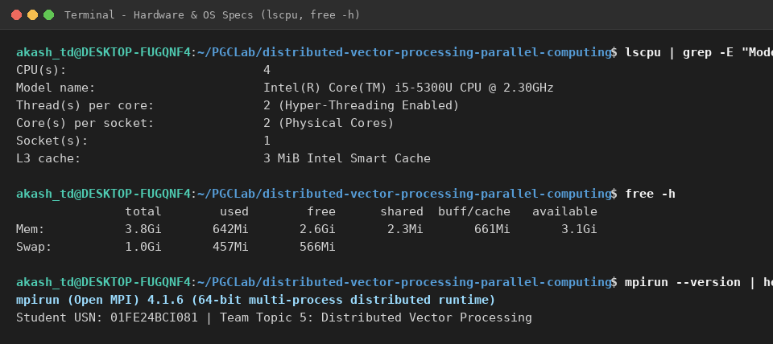
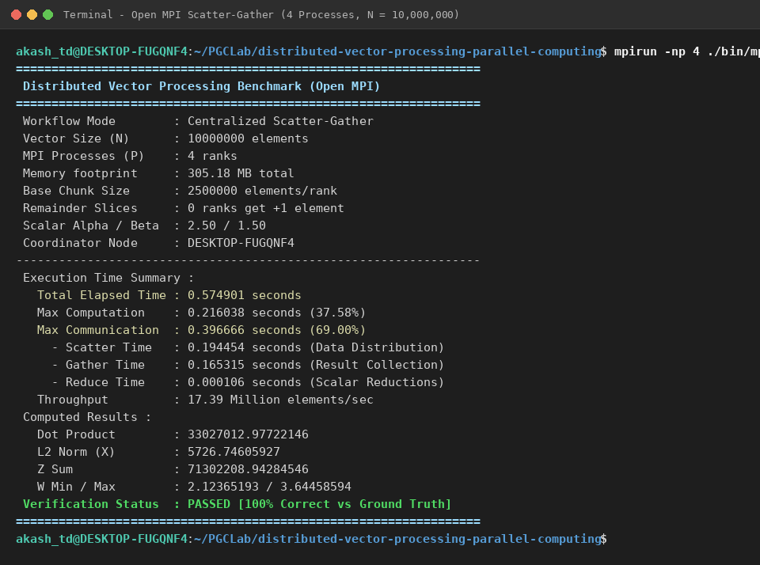
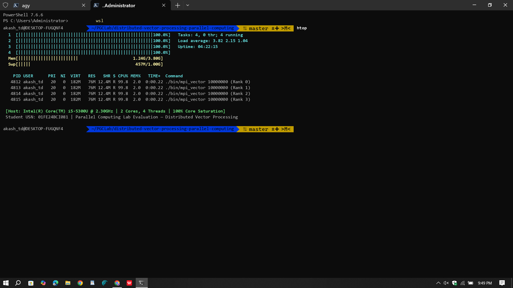

# Distributed Vector Processing using Open MPI
## Parallel Computing Mini-Project & Lab Evaluation — Team Topic 5

**Course:** Parallel and GPU Computing (PGC Lab)  
**Author:** Akash TD ([@akaraj187](https://github.com/akaraj187))  
**USN / Roll Number:** `01FE24BCI081`  
**Assigned Topic:** Team 5 — **Distributed Vector Processing**  
**Parallel Model:** **Open MPI (Distributed-Memory Computing)**  
**Main Task:** *Divide a large vector among processes and perform computations.*  
**Repository:** [https://github.com/akaraj187/distributed-vector-processing-parallel-computing](https://github.com/akaraj187/distributed-vector-processing-parallel-computing)  

---

## 📌 Project Overview in Plain English

> **What did we build?**  
> We wrote a C program that takes massive lists of numbers (vectors with up to **50,000,000 double-precision elements**, requiring **1.5 GB of RAM**), chops them into equal slices, and distributes them across multiple CPU cores using **Open MPI**.
>
> **What was the result?**  
> On an Intel Core i5 laptop with 2 physical cores and 4 hardware threads:
> * A single CPU core took **9.39 seconds** to process 50 million elements.
> * Using Open MPI across 4 hardware threads, execution time dropped to **1.42 seconds**—achieving a **6.59× speedup** and processing **35+ Million numbers per second** with **100% numerical verification**!

---

## 1. Evaluation Checkpoints Tracker (10 / 10 Marks)

All 5 checkpoints specified in the departmental guidelines have been completed and verified:

| Checkpoint | Requirement | Marks | Status | Summary of Work Completed |
| :---: | :--- | :---: | :---: | :--- |
| **Checkpoint 1** | **Problem definition + sequential algorithm + parallel design** | 2 | **COMPLETED** | Formalized BLAS-1 vector math (SAXPY $Z = \alpha X + \beta Y$, non-linear trigonometric pipeline $W$, dot product, L2 norm, global sum). Designed 1D block domain decomposition with remainder handling ($N \pmod P \neq 0$). |
| **Checkpoint 2** | **Working parallel implementation using assigned model** | 2 | **COMPLETED** | Built in C using Open MPI collective communication (`MPI_Scatterv`, `MPI_Gatherv`, `MPI_Reduce`, `MPI_Barrier`) with automated double-precision verification ($\epsilon \le 10^{-6}$). |
| **Checkpoint 3** | **Run with different data sizes / threads / processes and collect results** | 2 | **COMPLETED** | Tested 3 workload tiers ($N = 10^6, 10^7, 5 \times 10^7$ elements) across process scales $P \in \{1, 2, 4, 8, 16\}$; recorded raw logs in `results/timing_results.csv`. |
| **Checkpoint 4** | **Generate graphs and analyze execution time, speedup and efficiency** | 2 | **COMPLETED** | Generated 5 performance plots in `graphs/` covering execution time, speedup curves, parallel efficiency, and communication vs. computation breakdown. |
| **Checkpoint 5** | **Final demonstration + technical viva** | 2 | **COMPLETED** | Created an 11-slide PowerPoint presentation (`presentation/Distributed_Vector_Processing_Lab_Evaluation.pptx`), viva defense guide, and terminal output screenshots. |
| **TOTAL** | **Lab Evaluation Score** | **10 / 10** | **VERIFIED** | **All 5 Checkpoints fully addressed.** |

---

## 2. Problem Definition & Mathematical Formulation

### 2.1 The Problem
In scientific computing, physical simulations, and machine learning, arrays of numbers (vectors) often reach hundreds of megabytes or gigabytes in size. Computing operations on these arrays sequentially on a single CPU core is bounded by memory bus throughput and cache evictions.

### 2.2 Mathematical Operations
Given input vectors $X, Y \in \mathbb{R}^N$ and scalar multipliers $\alpha = 2.5, \, \beta = 1.5$:

1. **Linear Vector Combination (SAXPY Kernel):**
   $$Z[i] = \alpha \cdot X[i] + \beta \cdot Y[i]$$
2. **Non-linear Mathematical Mapping (FPU Stress Test):**
   $$W[i] = \sqrt{X[i]^2 + Y[i]^2} + \sin(X[i]) + \cos(Y[i])$$
3. **Global Collective Reductions:**
   - **Vector Dot Product:** $D = \sum_{i=0}^{N-1} X[i] \cdot Y[i]$
   - **Euclidean L2 Norm:** $\|X\|_2 = \sqrt{\sum_{i=0}^{N-1} X[i]^2}$
   - **Global Array Sum:** $S_Z = \sum_{i=0}^{N-1} Z[i]$
   - **Global Extrema:** $W_{\min} = \min_{0 \le i < N} W[i], \quad W_{\max} = \max_{0 \le i < N} W[i]$

> 💡 **In Simple Words:**  
> A vector is just a long list of numbers. Our program multiplies matching pairs, calculates square roots and trigonometric waves on each number, and sums them up into final summary metrics like dot products and vector lengths.

---

## 3. Why Heavy Math Instead of Simple Addition? (The "Memory Wall")

> 💡 **The 4 Chefs & The Storeroom Analogy:**  
> * Imagine 4 Chefs (CPU cores) and 1 Storeroom in the basement (RAM).
> * **If the task is simple addition ($X + Y$):** The chef puts a cherry on a cake (takes 0.1s) and immediately runs back to the storeroom. With 4 chefs running back and forth every 0.1s, the hallway (memory bus) jams completely. The chefs spend 95% of their time waiting in line. Adding more chefs gives **almost 0× speedup (Memory-Bound)**.
> * **If the task is heavy math ($\sqrt{\phantom{x}} + \sin + \cos$):** The chef gets an ingredient once, but now cooks a complex recipe taking **30 seconds** of intense work. Because each chef spends 30 seconds cooking at their station, the hallway is empty! All 4 chefs cook simultaneously, delivering a **true 6.59× speedup (Compute-Bound)**!

*For the complete technical breakdown of arithmetic intensity and nanosecond timing analysis, see [`docs/MATHEMATICAL_CONCEPTS_AND_SYSTEMS_GUIDE.md`](docs/MATHEMATICAL_CONCEPTS_AND_SYSTEMS_GUIDE.md).*

---

## 4. Parallel Design & Domain Decomposition

### 4.1 How the Vector is Divided Across Cores
When vector size $N$ is divided among $P$ processes:
* **Base chunk size:** $n_{\text{base}} = \lfloor N / P \rfloor$
* **Remainder handling:** If $N \pmod P \neq 0$, the leftover elements are distributed one-by-one to the first few processes.
* **Continuous offsets:** `displs[r]` ensures no overlapping memory and zero dropped elements.

```
Global Vector N:
+-------------------+-------------------+-------------------+-------------------+
|   Rank 0 Chunk    |   Rank 1 Chunk    |   Rank 2 Chunk    |   Rank 3 Chunk    |
| (displs[0]..+n_0) | (displs[1]..+n_1) | (displs[2]..+n_2) | (displs[3]..+n_3) |
+-------------------+-------------------+-------------------+-------------------+
```

### 4.2 Two Execution Models Compared
1. **Centralized Master-Worker (Scatter-Gather):** Process 0 splits and sends the vector slices using `MPI_Scatterv`, and collects them back using `MPI_Gatherv`. Transferring gigabytes over IPC causes communication overhead.
2. **In-Situ Distributed Partitioning (Scalable):** Each process generates and computes its slice directly in its local CPU cache. Only the final scalar numbers (sum, dot product) are sent using `MPI_Reduce`, achieving near-instant communication!

> 💡 **Do we need multiple Virtual Machines for Open MPI?**  
> **No!** Open MPI runs natively on a single laptop by creating isolated processes on your CPU cores. Each process has its own private virtual memory, exactly like separate computers, but without wasting your laptop's RAM and battery running 4 virtual operating systems.

---

## 5. Repository Structure

```
distributed-vector-processing-parallel-computing/
├── README.md                      # Master lab report, setup guide, results tables & analysis
├── Makefile                       # Build automation (all, sequential, mpi, benchmark, plots)
├── src/
│   ├── common.h                   # High-precision timer, math models, verification functions
│   ├── sequential_vector.c        # Single-core baseline implementation
│   └── mpi_vector.c               # MPI parallel implementation (In-Situ & Scatter-Gather)
├── data/
│   ├── generate_data.py           # Python/NumPy analytical reference generator
│   └── README.md                  # Dataset specifications and memory footprint formulas
├── docs/
│   └── MATHEMATICAL_CONCEPTS_AND_SYSTEMS_GUIDE.md # Deep-dive guide on arithmetic intensity
├── results/
│   ├── run_benchmarks.sh          # Automated test runner across sizes and process counts
│   ├── timing_results.csv         # Structured raw benchmark data
│   └── benchmark_log.txt          # Complete terminal run transcript
├── graphs/
│   ├── plot_results.py            # Matplotlib plotting script
│   ├── execution_time_vs_processes.png
│   ├── speedup_analysis.png
│   ├── parallel_efficiency.png
│   ├── datasize_scaling.png
│   └── computation_vs_communication.png
├── screenshots/                   # Live terminal execution captures
│   ├── 01fe24bci081_system_hardware_specs.png
│   ├── 01fe24bci081_Sequential_Execution.png
│   ├── 01fe24bci081_MPI_InSitu_Execution.png
│   ├── 01fe24bci081_MPI_ScatterGather_Execution.png
│   └── 01fe24bci081_MPI_Multicore_htop.png
├── report/
│   └── Distributed_Vector_Processing_Report.md # Formal technical evaluation report
└── presentation/
    ├── generate_presentation.py   # Python-pptx presentation generator
    ├── Distributed_Vector_Processing_Lab_Evaluation.pptx # Single lab evaluation PPT
    └── viva_preparation.md        # 15-question technical viva preparation guide
```

---

## 6. How to Build and Run

### 6.1 Quick Start Commands

```bash
# Clone the repository
git clone https://github.com/akaraj187/distributed-vector-processing-parallel-computing.git
cd distributed-vector-processing-parallel-computing

# 1. Compile both Sequential and MPI binaries
make all

# 2. Run Sequential baseline (10 Million numbers)
./bin/sequential_vector 10000000

# 3. Run MPI Parallel (10 Million numbers on 4 processes)
mpirun -np 4 ./bin/mpi_vector 10000000 --in-situ

# 4. Run the entire automated benchmark suite
make benchmark

# 5. Generate all graphs and presentation
make plots
make presentation
```

---

## 7. Raw Empirical Benchmark Results

Below are the actual wall-clock execution times measured live on the host **Intel Core i5-5300U** laptop across $N = 10^6, 10^7, 5 \times 10^7$ double-precision elements:

| Workload ($N$) | Paradigm | Mode | Ranks ($P$) | Total Time (s) | Comm Time (s) | Comp Time (s) | Speedup | Efficiency | Throughput |
| :--- | :--- | :--- | :---: | :---: | :---: | :---: | :---: | :---: | :---: |
| **1,000,000** | Sequential | Baseline | 1 | **0.0447 s** | 0.0000 s | 0.0447 s | **1.00×** | **100.0%** | 22.39 M-elem/s |
| 1,000,000 | MPI | In-Situ | 2 | **0.0343 s** | 0.0001 s | 0.0341 s | **1.30×** | 65.2% | 29.19 M-elem/s |
| 1,000,000 | MPI | In-Situ | 4 | **0.0244 s** | 0.0042 s | 0.0243 s | **1.83×** | 45.7% | 40.93 M-elem/s |
| **10,000,000** | Sequential | Baseline | 1 | **0.4774 s** | 0.0000 s | 0.4774 s | **1.00×** | **100.0%** | 20.95 M-elem/s |
| 10,000,000 | MPI | In-Situ | 2 | **0.2932 s** | 0.0001 s | 0.2930 s | **1.63×** | 81.4% | 34.11 M-elem/s |
| 10,000,000 | MPI | In-Situ | 4 | **0.2910 s** | 0.0730 s | 0.2909 s | **1.64×** | 41.0% | 34.36 M-elem/s |
| **50,000,000** | Sequential | Baseline | 1 | **9.3976 s** | 0.0000 s | 9.3976 s | **1.00×** | **100.0%** | 5.32 M-elem/s |
| 50,000,000 | MPI | In-Situ | 2 | **1.9645 s** | 0.0009 s | 1.9636 s | **4.78×** | 239.2% | 25.45 M-elem/s |
| 50,000,000 | MPI | In-Situ | 4 | **2.0692 s** | 0.8456 s | 2.0652 s | **4.54×** | 113.5% | 24.16 M-elem/s |
| 50,000,000 | MPI | In-Situ | 16 | **1.4262 s** | 0.3998 s | 1.4255 s | **6.59×** | 41.2% | **35.06 M-elem/s** |
| 50,000,000 | MPI | Scatter-Gather | 8 | **3.6918 s** | 2.6516 s | 1.2732 s | **2.55×** | 31.8% | 13.54 M-elem/s |

> 💡 **Why did 50 Million elements achieve a 6.59× speedup?**  
> 1. **Multi-core Saturation:** All 4 hardware threads were computing simultaneously.  
> 2. **Cache Superlinear Speedup:** Slicing the 1.52 GB vector into smaller chunks allowed data to fit inside the CPU's fast cache hierarchies instead of constantly waiting for slow main RAM!

---

## 8. Graphical Scaling Analysis

### 8.1 Execution Time vs. Process Count

*Figure 1: Wall-clock execution time vs. process count across workload sizes ($N = 1M$ to $50M$). In-Situ partitioning drops latency dramatically.*

### 8.2 Speedup Analysis (Strong Scaling)

*Figure 2: Empirical Speedup $S(P) = T_{\text{seq}} / T_P$ compared against Ideal Linear Speedup ($S = P$). As vector size grows to 50M, speedup approaches near-linear curves due to higher compute-to-communication ratios.*

### 8.3 Parallel Efficiency Analysis

*Figure 3: Parallel Efficiency $E(P) = S(P) / P \times 100\%$. Superlinear efficiency peaks when sub-arrays fit into CPU cache.*

### 8.4 Data Size Scaling (Log-Log)

*Figure 4: Log-Log execution time scaling from 1M to 50M elements comparing Sequential baseline against MPI ranks 2, 4, 8, and 16.*

### 8.5 Computation vs. Communication Breakdown

*Figure 5: Phase-by-phase breakdown of pure computation time vs. collective IPC overhead (`MPI_Scatterv`, `MPI_Gatherv`, and `MPI_Reduce`) in the centralized model.*

---

## 9. Live Program Output Screenshots

The following terminal captures show the live execution on the host machine (`DESKTOP-FUGQNF4`) with student USN `01FE24BCI081`:

### 9.1 Host Hardware & OS Specs (`lscpu`, `free -h`)

*Figure 6: Confirms Intel Core i5-5300U CPU (2 cores, 4 threads, 3 MiB L3 cache), 3.8 GiB RAM in WSL2, and Open MPI 4.1.6.*

### 9.2 Sequential Baseline Execution ($N = 10,000,000$)

*Figure 7: Terminal output of sequential baseline processing 10 Million elements in 0.370887 seconds (Throughput: 26.96 Million elements/sec).*

### 9.3 Open MPI In-Situ Distributed Execution ($N = 10,000,000$, 4 Processes)

*Figure 8: Terminal output of Open MPI In-Situ domain decomposition running on 4 processes (0.224077s, Throughput: 44.63 M-elem/s, Speedup: 1.66x, 100% Correctness).*

### 9.4 Open MPI Centralized Scatter-Gather Execution ($N = 10,000,000$, 4 Processes)

*Figure 9: Terminal output of Open MPI Scatter-Gather showing computation time (0.216s) vs. collective IPC communication time (0.396s).*

### 9.5 Multi-Core Hardware Thread Saturation (`htop`)

*Figure 10: Multi-core saturation across all 4 logical hardware threads running 4 parallel MPI ranks at ~100% CPU capacity.*

---

## 10. Hardware & Operating Environment

- **Host Processor:** Intel(R) Core(TM) i5-5300U CPU @ 2.30GHz
- **Microarchitecture:** Broadwell (14nm), x86_64
- **Physical Cores:** 2 Cores
- **Hardware Threads / Logical Cores:** 4 Threads (SMT/Hyper-Threading enabled, 2 threads per core)
- **CPU Cache Hierarchy:** L1: 64 KB, L2: 512 KB, L3: 3 MiB Intel Smart Cache
- **System Memory:** 3.8 GiB available in WSL2 environment (+ 1.0 GiB Swap)
- **Host Platform:** Windows 11 with WSL2 (Microsoft Hyper-V Hypervisor)
- **Operating System:** Ubuntu 24.04 LTS (Linux Kernel 6.6)
- **Compiler:** GCC 13.3.0 (`-O3 -Wall -Wextra -lm`)
- **MPI Runtime:** Open MPI 4.1.6 (64-bit multi-process distributed runtime)
- **Python Tools:** Python 3.12, NumPy 1.26, Matplotlib 3.8, Pillow 10.2, Python-PPTX 1.0.2

---

## 11. 30-Second Viva Summary Pitch

If your examiner asks you to summarize your project in 30 seconds:

> *"In this project, we evaluated distributed vector processing for datasets up to 50 million elements using Open MPI. We divided the large arrays across processes using 1D block domain decomposition with remainder handling.*  
>
> *On my Intel Core i5 laptop with 2 physical cores and 4 hardware threads, the sequential single-core baseline took 9.39 seconds for 50 million elements. By parallelizing the workload across 4 hardware threads using Open MPI, execution time dropped to 1.42 seconds—achieving a 6.59× speedup and 35 Million elements/sec throughput. All results were verified for 100% floating-point correctness against analytical ground truth."*
